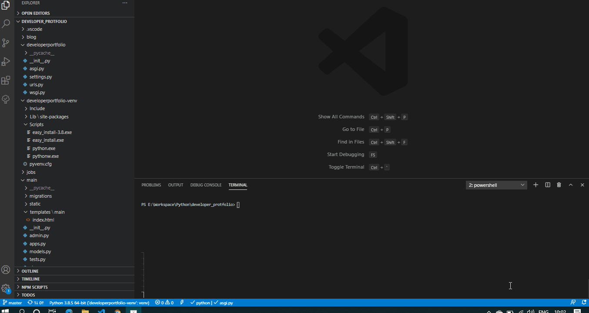

# Developer Portfolio
Portfolio website for Developer using Python, Django, HTML, SCSS


## Steps to run this  project
### This is the guide to run this project only on your local machine
1. Install Python 3 or above.
2. Create virtual environment for project and project dependencies so that it won't affect other projects. It is best practice to provide a dedicated environment for each Django project you create. 
``py -m venv project-name``

   **Please note:** Everytime you start project after closing activate your virtual environment for project. 
   #### **Please note:** Everytime you start project after closing IDE, system or project folder you have to/need to activate your virtual environment `` path_to_virtual_env_folder\script\activate.bat `` on windows and `` source path_to_virtual_env_folder\bin\activate `` on linux, otherwise dependency/packages install above will not work or there will some module not found errors.
 


3. Install Project Dependencies

    To install all the dependencies/packages used in project.

    ``pip install -r requirements.txt``

4. Installing PostgreSQL 12
Go to [PostgreSQL Download](https://www.postgresql.org/download/) and follow installation instructions.
    Adding user and granting all access on the database to the user.

    Adding user: [For more information](https://www.postgresql.org/docs/8.0/sql-createuser.html)
    ``CREATE USER yourusername WITH PASSWORD 'youruserpassword' CREATEDB;``

    Adding database: [For more information](https://www.postgresql.org/docs/9.0/sql-createdatabase.html)
    ``CREATE DATABASE yourdatabasename; ``
    
    Providing access to that user on db: [For more information](https://www.postgresql.org/docs/9.0/sql-grant.html)
    ``grant all privileges on database yourdatabasename to yourusername;``


5. Adding config file
    
    Add file name appsettings.json in project root directory.

    After adding appsettings.json copy/paste the below settings

    ```json    
    {
    
        "DATABASE_USER": "",

        "DATABASE_NAME": "",
        
        "DATABASE_PASSWORD": "",
        
        "DATABASE_PORT": "",
        
        "DATABASE_HOST": "",
        
        "DATABASE_ENGINE": "django.db.backends.postgresql",
        
        "EMAIL_HOST": "",
        
        "EMAIL_PORT": "",
        
        "EMAIL_HOST_USER": "",
        
        "EMAIL_HOST_PASSWORD": "",
        
        "SECRET_KEY": "^j5q4(halslig96013*d!fj1)w)ee&9ryyrymrm@t+1e8n_cs&t7a3!ksutuu",
        
        "EMAIL_RECEIVER" : ""
    } 
    ```


    After adding this to appsettings.json modify these fields:

    1. DATABASE_USER - Your database username of PostgreSQL.
    2. DATABASE_NAME - Name of the database to  be used for project.
    3. DATABASE_PASSWORD - Database user (DATABASE_USER) password
    4. DATABASE_PORT - Database port on which it is running
    5. DATABASE_HOST - Host will be the ip address where postgresql is running can be a virtual machine or docker address or localhost (127.0.0.1).
    6. DATABASE_ENGINE - In case of postgresql engine name will be: **django.db.backends.postgresql**
    This application have contact us section, the below settings are for that 
    7. EMAIL_HOST  - The host to use for sending email. In my case I used Gmail (smtp.gmail.com)
    8. EMAIL_PORT - Port to use for the SMTP server defined in EMAIL_HOST. Since I used gmail it was 587. 
    9. EMAIL_HOST_USER - Username to use for the SMTP server defined in EMAIL_HOST. For gmail it was my *******@gmail.com Email Id
    10. EMAIL_HOST_PASSWORD - Password to use for the SMTP server defined in EMAIL_HOST. This setting is used in conjunction with EMAIL_HOST_USER when authenticating to the SMTP server. In my case I have generated app password for gmail you can follow the steps here [Sign in with App Passwords](https://support.google.com/accounts/answer/185833?hl=en) or follow this video of Corey Schafer [Django Tutorials](https://www.youtube.com/watch?v=-tyBEsHSv7w&list=PL-osiE80TeTtoQCKZ03TU5fNfx2UY6U4p&index=12)
    11. SECRET_KEY - A secret key for a particular Django installation. This is used to provide cryptographic signing, and should be set to a unique, unpredictable value.
    12. EMAIL_RECEIVER - Receiver's email address.

We have setup our dev machine now it is time to run project
Since Django has its own inbulit models and admin site, we are going to run some commands in the project root directory:
1. Run ``  python manage.py makemigrations ``
    The above command will create migrations in each folder will latest data model changes
2. Run `` python manage.py migrate `` 
    The above command will run the migration scripts and create table in database
3. Now we need to add superuser(admin) for handling the data from admin site
    Run `` python manage.py createsuperuser `` this will create a admin user for the website. Enter the following details and remember them:
    1. Username
    2. Email
    3. Password
4. Run `` python manage.py runserver `` to run the website

If everything is in order you see a website running on http://127.0.0.1:8000 or http://localhost:8000

Now go to admin panel of website navigate to http://127.0.0.1:8000/admin .

Add some data from admin panel,and see it live on your homepage i.e. (http://127.0.0.1:8000 or http://localhost:8000)


## Building SCSS

You can build the scss using following command

``python manage.py sass .\main\static\main\scss\ .\main\static\main\css\``


# Production deployment on Linux based server

 I followed this video of Corey Schafer
 
 https://youtu.be/Sa_kQheCnds?list=PL-osiE80TeTtoQCKZ03TU5fNfx2UY6U4p


# HTML Design for portfolio
  I would like to thank [RyanFitzgerald](https://github.com/RyanFitzgerald) for his devportfolio template.
  
  I have used this template
  https://github.com/RyanFitzgerald/devportfolio
  


# Demo

